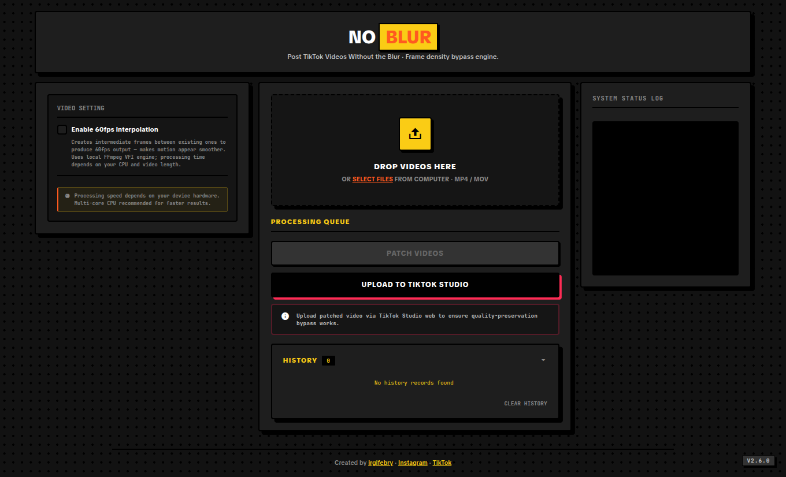

# NoBlur — Post TikTok Videos Without the Blur

NoBlur is a client-side web application that processes MP4 and MOV video containers locally in your browser to bypass aggressive server-side recompression when uploading to TikTok. It uses MP4 sample-table frame density inflation as its core bypass mechanism, with an optional 60fps VFI interpolation path. All processing stays on-device — no data is uploaded to external servers.



---

## Technical Architecture

NoBlur runs two pipelines depending on the Interpolation toggle.

### Non-Interpolation Path (Frame Density Inflation)

The primary path for bypassing TikTok recompression. Inflates the MP4 sample table using pure binary manipulation — no FFmpeg re-encode, preserving 100% video quality with 10-100x faster processing.

1. **Container Normalization:** Reorders the MP4 so `moov` atom precedes `mdat` (fast-start) and rewrites `ftyp` brand to `isom` for compatibility.
2. **Frame Density Inflation:** Multiplies the sample table by 10x. Real frames are kept; codec-aware dummy samples are appended with `stts`/`stsz`/`stco`/`stsc` patched and padding written at EOF. Supports VFR, 64-bit chunk offsets (co64), and per-codec dummy sizes (avc1/avc3: 8B, hvc1/hev1: 16B, vp09/av01: 4B). TikTok reads the inflated frame count as high-density content and skips heavy recompression.

### Interpolation Path (60fps VFI + Inflation Pipeline)

When the Interpolation toggle is enabled, FFmpeg.wasm is lazy-loaded to run motion-compensated frame interpolation (`minterpolate`) to 60fps at the selected output resolution (1080p or 2K). Audio is copied without re-encoding (`-c:a copy`) for faster processing. The interpolated video then passes through the same frame density inflation pipeline. The FFmpeg instance is terminated after each video to prevent stale WASM state.

---

## Key Features

- **Pure Container Inflation:** No FFmpeg re-encode in the main path — preserves 100% video quality, 10-100x faster than transcoding.
- **TikTok Compression Bypass:** Codec-aware frame density inflation (10x default) makes videos pass TikTok's quality-preservation threshold. Works at both 1080p and 2K.
- **Codec-Aware Inflation:** Per-codec dummy sample sizes (avc1/avc3: 8B, hvc1/hev1: 16B, vp09/av01: 4B), VFR support, and co64 for 64-bit chunk offsets.
- **Single-Pass Pipeline:** Container normalization followed by sample-table inflation in one operation.
- **Selectable Output Resolution:** 1080p or 2K (1440p) when interpolation is enabled. VFI processes at 1080p then upscales to 2K.
- **Client-Side Only:** 100% browser-local. Zero server upload.
- **Multi-Format & Codec Input:** MP4 and MOV with H.264, HEVC/H.265, and others.
- **Bulk Processing Queue:** Drag/drop or select multiple videos; processed sequentially.
- **Screen Wake Lock:** Keeps display active during processing; re-acquires on visibility change.
- **TikTok Studio Shortcut:** One-click redirect to TikTok Studio with mobile desktop-mode guidance.
- **Codec Detection Refactored:** Shared codec helpers in `mp4-boxes.mjs` eliminated duplication across modules.
- **Binary Pipeline Tests:** Round-trip tests with real video fixtures (H.264, HEVC, co64, MOV, mdat-first) cover normalize + inflate + playable output.
- **Fast-Start Container Fix:** Recalculates chunk offsets (`stco`/`co64`) on every structural shift.
- **Neo-Brutalist Dark UI:** Flat offset shadows, solid dark panels, neon accents, responsive mobile layout.
- **Local History:** IndexedDB with output-buffer thumbnails.

---

## File Structure

```text
NoBlur/
├── ffmpeg-core/          # Single-thread FFmpeg WASM
├── ffmpeg-core-mt/       # Multi-thread FFmpeg WASM (SAB)
├── ffmpeg-worker/        # FFmpeg.wasm class worker
├── scripts/
│   └── generate-changelog.mjs
├── src/
│   ├── mp4-boxes.mjs     # MP4 atom parser + codec helpers
│   ├── mp4-inflate.mjs   # Sample-table inflation logic
│   ├── mp4-normalize.mjs # Container normalization (moov→mdat, ftyp)
│   ├── changelog.mjs     # In-app changelog panel
│   ├── changelog-data.mjs
│   └── changelog.test.mjs
├── test/
│   ├── fixtures/         # Real MP4/MOV test vectors
│   ├── generate-fixtures.mjs
│   └── pipeline.test.mjs # Binary pipeline round-trip tests
├── index.html
├── style.css
├── app.js
├── db.js                 # IndexedDB wrapper
├── coi-serviceworker.js  # Cross-origin isolation for SAB
├── .nojekyll             # Disable GitHub Pages Jekyll
├── vite.config.js
├── package.json
├── biome.json
├── README.md
└── CHANGELOG.md
```

---

## Platform Notes

| Platform | Deployment | FFmpeg VFI |
|---|---|---|
| Vercel | `npm build`, server COEP headers | Multi-thread (SAB) |
| GitHub Pages | Deploy from branch, `.nojekyll`, COI service worker | Multi-thread (SAB) |
| Local (dev) | `vite`, dev-server COEP headers | Multi-thread (SAB) |

GitHub Pages serves files from the repo root directly (no Jekyll processing due to `.nojekyll`). Cross-origin isolation is provided by the COI service worker at `/coi-serviceworker.js`. If the service worker is still registering on first load, the page may not be immediately isolated — a page reload ensures it is active.

---

## Disclaimer

This utility rewrites MP4 container metadata using sample-table inflation to bypass platform recompression. No video or audio data is re-encoded in the main pipeline, preserving original quality. The interpolation path (optional) uses FFmpeg.wasm for frame rate conversion only. Designed to work with valid MP4 and MOV containers. Always keep backups of your original video files before processing.

See [CHANGELOG.md](./CHANGELOG.md) for the full release history.

## Real Telegram Login setup

This build uses Telegram OpenID Connect (Authorization Code + PKCE).

### 1. Choose one stable production domain

Example:

`https://theziess-method-test-qabd.vercel.app`

Avoid changing between Vercel preview domains because Telegram only accepts URLs that were registered beforehand.

### 2. Configure BotFather

1. Open `@BotFather`.
2. Select your bot → **Bot Settings** → **Web Login**.
3. Add both Allowed URLs (replace the example domain with your real production domain):
   - `https://theziess-method-test-qabd.vercel.app`
   - `https://theziess-method-test-qabd.vercel.app/api/auth/telegram/callback`
4. Copy the **Client ID** and **Client Secret** shown by BotFather.

### 3. Configure Vercel Environment Variables

Add these variables in **Vercel → Project Settings → Environment Variables**:

- `TELEGRAM_CLIENT_ID` — Client ID from BotFather Web Login
- `TELEGRAM_CLIENT_SECRET` — Client Secret from BotFather Web Login
- `TELEGRAM_REDIRECT_URI` — exact callback URL, for example `https://theziess-method-test-qabd.vercel.app/api/auth/telegram/callback`
- `SESSION_SECRET` — a random value of at least 24 characters
- `DATABASE_URL` — your PostgreSQL connection string

`TELEGRAM_BOT_TOKEN` is not used by this OIDC login flow. It is only needed if another backend feature sends Telegram bot messages.

### 4. Redeploy and test

After saving the environment variables, redeploy the project. Open the production domain, click **Login with Telegram**, then click **Continue with Telegram**.

The initiation endpoint is `/api/auth/telegram`. The callback endpoint registered with Telegram is `/api/auth/telegram/callback`.

## PostgreSQL database setup

This version permanently stores Telegram users, subscriptions, and KHQR demo payments in PostgreSQL.

1. Create a PostgreSQL database. Neon or Supabase works well with Vercel.
2. Add the PostgreSQL connection string as `DATABASE_URL` in Vercel → Project Settings → Environment Variables.
3. Keep `TELEGRAM_CLIENT_ID`, `TELEGRAM_CLIENT_SECRET`, `TELEGRAM_REDIRECT_URI`, and `SESSION_SECRET` configured.
4. Redeploy the project.
5. Open `/api/db-status` to confirm the database connection.

The API automatically creates the `users`, `subscriptions`, and `payments` tables on first use. You can also run `database.sql` manually in your PostgreSQL SQL editor.

Never expose `DATABASE_URL`, the Telegram bot token, or the session secret in frontend code.
